# Challenge Name: [Jack-of-All-Trades]

**Date:** 10 March 2026

**Difficulty:** Easy

1. Enumeration
I started things off with a classic Nmap scan. I used -sS to keep it quick and -p- to check every single port.

sudo nmap 10.114.131.92 -sS -p- -n -v
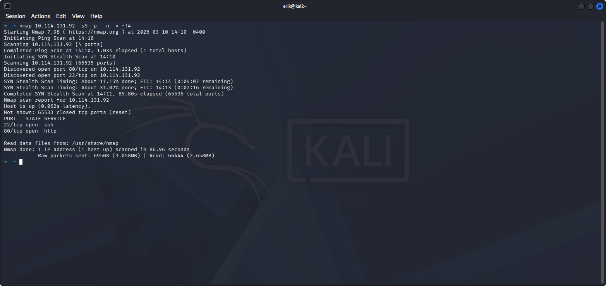
It found two ports. I dug a bit deeper with a version scan (-sV) to see exactly what services I was dealing with.
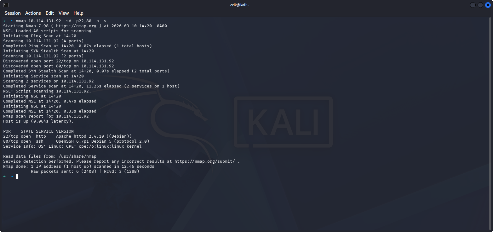

I also fired up Gobuster to see if there were any hidden folders on the web server. It’s a great way to find pages that aren't linked on the homepage.
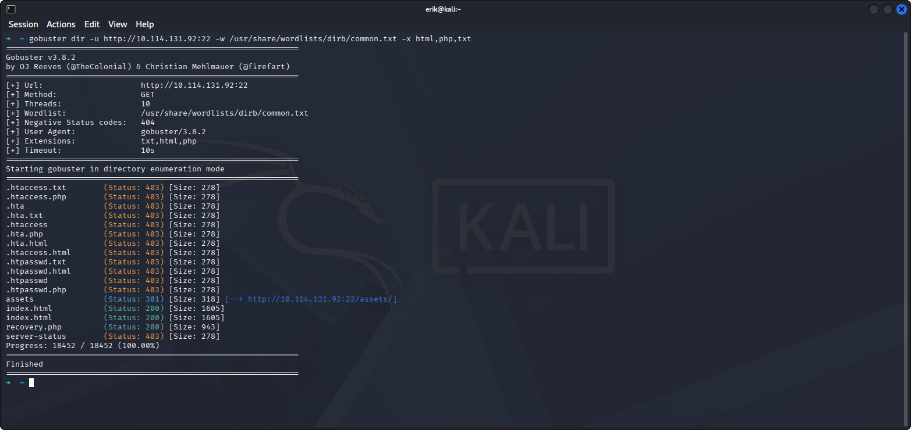

The Firefox Port Trick
The web server was running on Port 22. Firefox usually blocks this so I had to jump into about:config, find network.security.ports.banned.override, and add 22 so the browser would actually let me see the site.
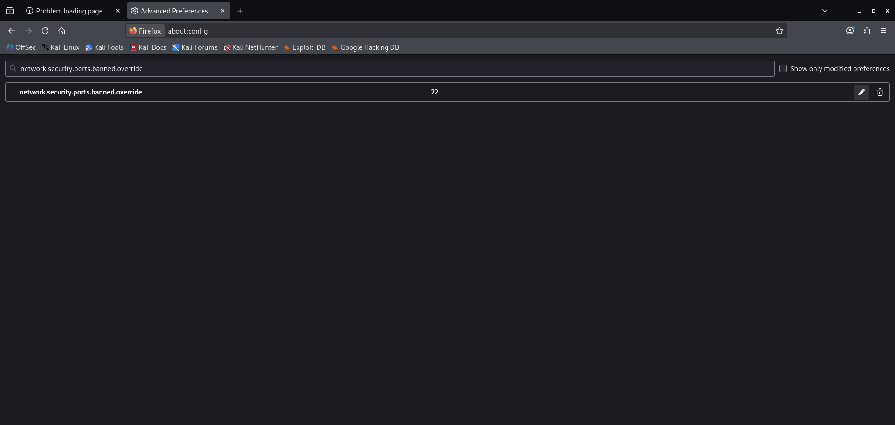

Once I got in, I checked the Page Source and found an encoded string. Used CyberChef to decode the Base64 gave me a password!
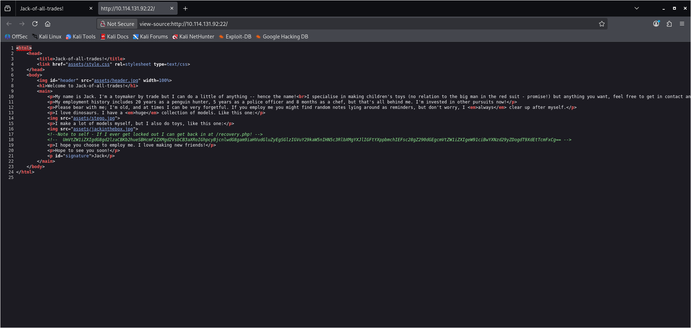
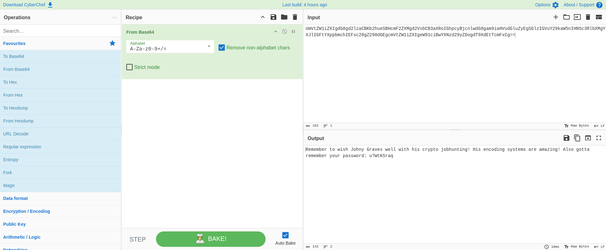

I also took the main header image from the site and ran it through Steghide. It gave a username and another password.
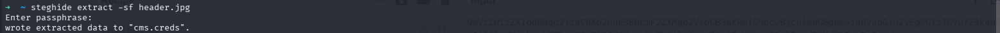

2. Breaking in
I found a page called /recovery.php that looked vulnerable to Command Injection. I tested it with ls -la and it worked perfectly.
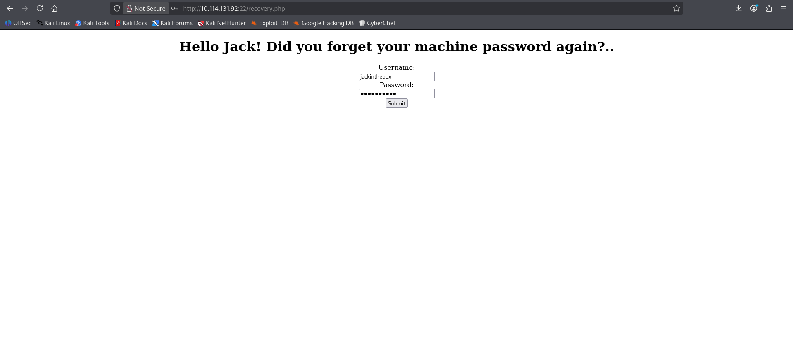

I set up a Netcat listener on my machine:
nc -lvnp 4444
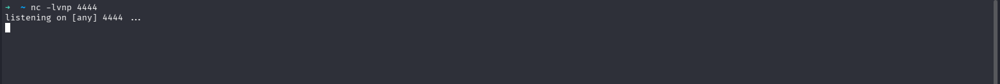

Then I sent a PHP shell payload through that injection point and boom—I caught the connection.
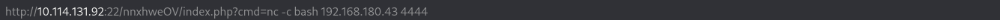
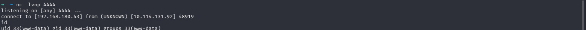

I found a list of passwords on the system, but I wasn't root yet. I used Hydra to brute-force the SSH login for a user named jack and finally got a proper login.
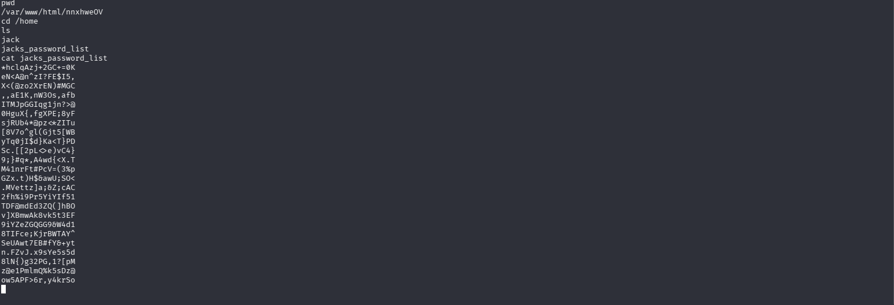
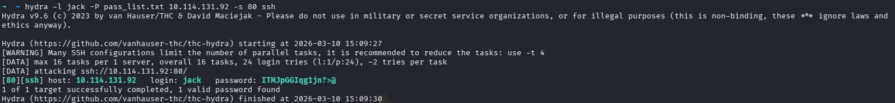
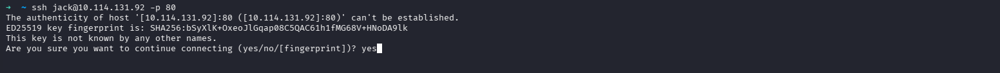

I downloaded the image and found the User flag
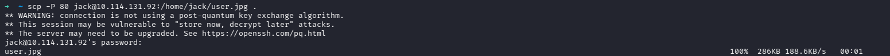
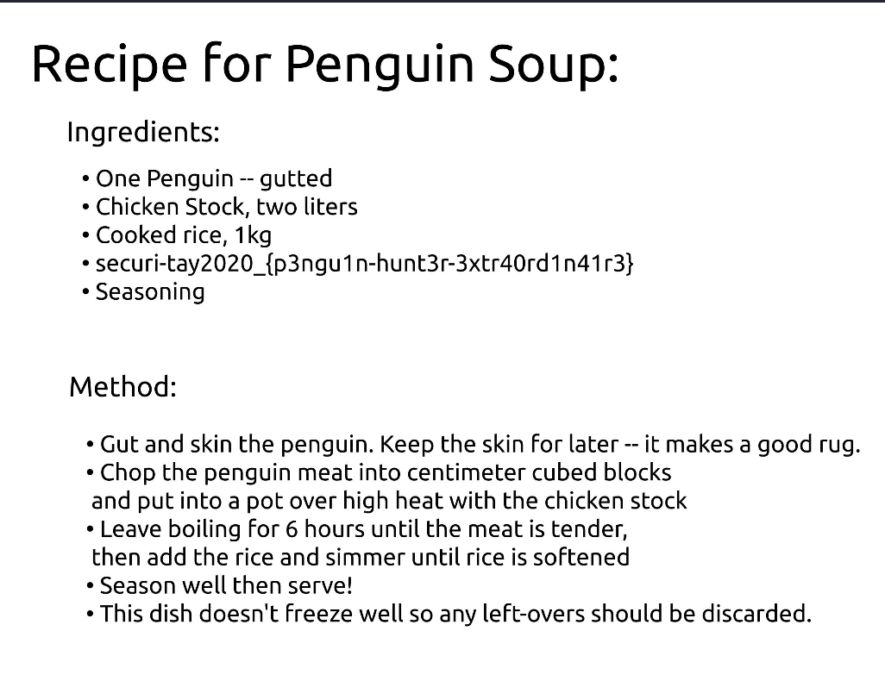

3. Getting to Root 
Once I was logged in as jack, I needed to find a way to become root. I searched for SUID binaries (files that run with root power) using this command:
find / -type f -perm -4000 2>/dev/null
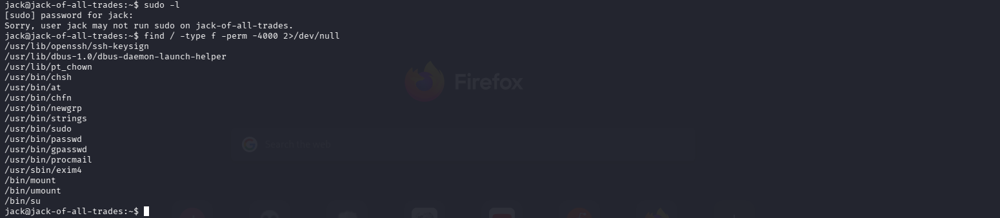

I saw that /usr/bin/strings was on the list. I checked GTFOBins and realized I could use strings to read any file on the system, even if I wasn't root. I used it to grab the root flag directly from the admin’s folder.
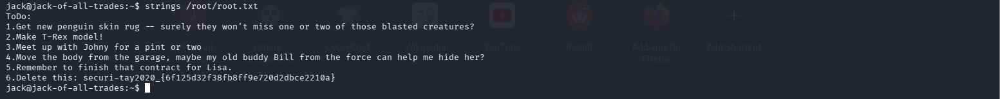

4. What I learned
   
Trust your gut on images: Steganography is a classic trick; always check the pictures.

SUID is dangerous: A simple tool like strings can become a huge security hole if it has the SUID bit set.

Don't trust default ports: Just because Port 22 is usually for SSH doesn't mean it can't be a website. Stay curious!
